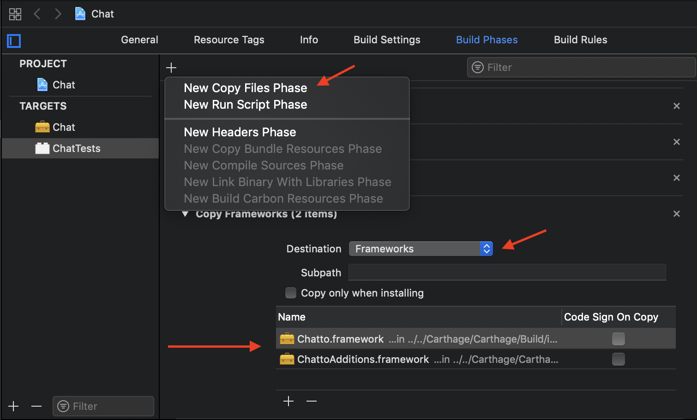

This is an example of explicit dependencies usage to manage complex dependency trees in your projects without using any 3rd party tools. This example uses Carthage to build and provide 3rd party frameworks.

You can check commit history for every single step that was made to setup this example.

### Project Folders

**Carthage** - a folder with frameworks built by Carthage shared between all projects.

**Modules** - a folder with frameworks shared between all projects. Modules can depend on other modules and Carthage frameworks.

**Apps** - a folder with apps. Apps can depend on modules and Carthage frameworks.

### Projects Dependencies

```
[Module] Chat
-- [Carthage] Chatto
-- [Carthage] ChattoAdditions

[Module] MyNetwork
-- [Carthage] Alamofire

[Module] CommonFeature
-- [Module] Chat
-- [Module] MyNetwork

[App] AppOne
-- [Module] Chat
-- [Carthage] SnapKit
-- [Carthage] Gallery

[App] AppTwo
-- [Modue] CommonFeature
-- [Carthage] SnapKit
```

All projects were created using Xcode. Modules were created using "Cocoa Touch Framework" template, apps - "Single View App" template.

### How to add Carthage dependency to a module

**Step 1**

Add Carthage dependencies by drag and drop .framework files from "Carthage/Build/iOS" folder to "Linked Frameworks and Libraries" area in General section of your module target's settings. 


You'll see a new group "Framework" appeared in the project structure containing added frameworks. 


It's important to check that all paths are relative.


**Step 2**

If you try to compile at this point you'll see "ld: framework not found" error. Xcode knows which frameworks should be linked but don't know where to find them. In order to fix it, you need to add a relative path to frameworks in "Frameworks Search Path" build setting (for example, "$(PROJECT_DIR)/../../Carthage/Carthage/Build/iOS/") to both module and unit tests targets.


**Step 3**

At this point your module and its' tests target should compile. But if your run the tests target you'll see a runtime error "Library not loaded: @rpath/YourFramework.framework/YourFramework". That means that YourFramework is no located in the test bundle.

A test bundle should contain all frameworks used by a module inside. First of all, you need to copy Swift standard libraries to the test bundle (it's disabled by default in some project templates, like "Cocoa Touch Framework"). You can do it by setting "Always Embed Swift Standard Libraries" to YES in the framework's tests target build settings. 


After that, you need to link and copy Carthage frameworks used by your module. Added them to "Link Binary with Libaries" build phase of module's test target. 


Create a new "Copy Phase" in "Build phases", choose "Frameworks" destination and drag and drop Carthage frameworks from "Frameworks" group to the copy phase.



That's it. Module's tests don't have runtime error anymore and pass succesfully. Your module is ready to use Carthage frameworks.

### How to add Carthage dependency to an app.

**Step 1** and **Step 2** are the same as for adding Carthage dependency to a module.

On **Step 3** instead of creating a new "Copy Phase" you need to use a script phase as described in Carthage documentation: https://github.com/Carthage/Carthage#if-youre-building-for-ios-tvos-or-watchos


At this point your app and app's test target should compile and run succesfully.

### How to add a module dependency that uses Carthage frameworks to another module

**Step 1**

For convenience, create a new group without folder and name it "Dependencies". Drag and drop another module's project to that group.


**Step 2**

Add modules to "Target Dependencies" and "Link Binary with Libraries" section


At this point your framework should compile

**Step 3**

Now you need to add all nested Carthage dependencies from added modules to the tests target. It was described previously and the final result sholud look like this


### How to add a module dependency that uses Carthage frameworks to an app

**Step 1** and **Step 2** are the same as in previous section with only difference that you should add all nested dependencies as well. For example, if you add CommonFeature module to your project, then you need to add Chat and MyNetwork nested dependencies. If your app doesn't use nested dependencies directly then you don't need to add them to  "Link Binary with Libaries" section.


Don't forget to embed all direct and nested dependencies in your app target:


**Step 3** is the same as in previous section.

